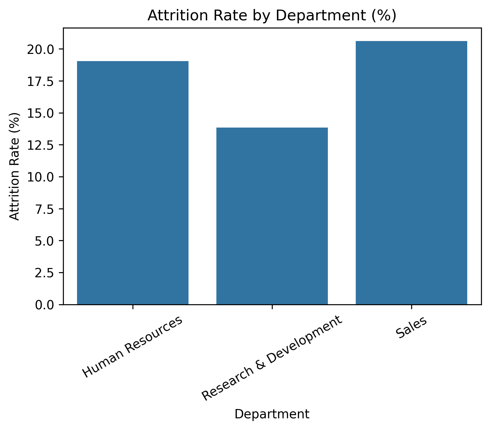
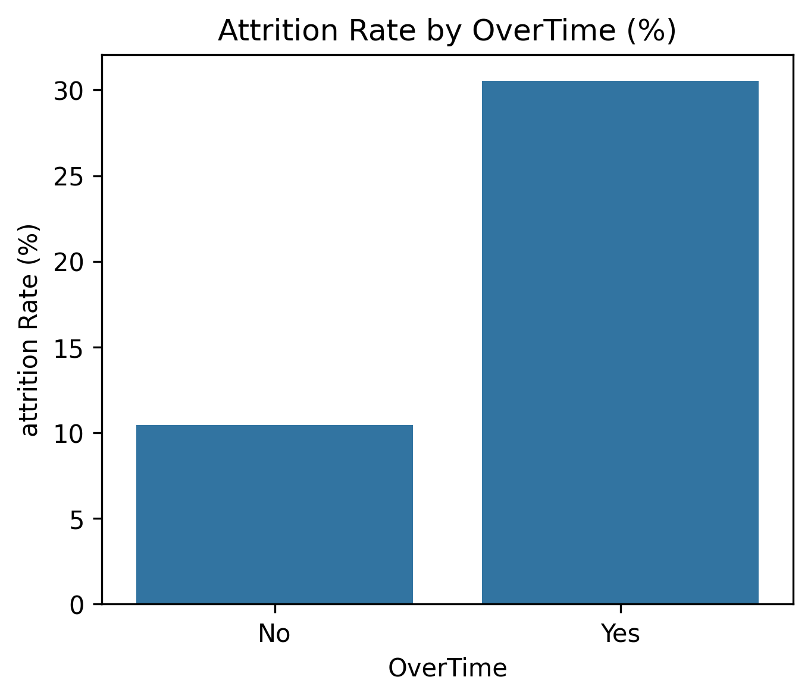
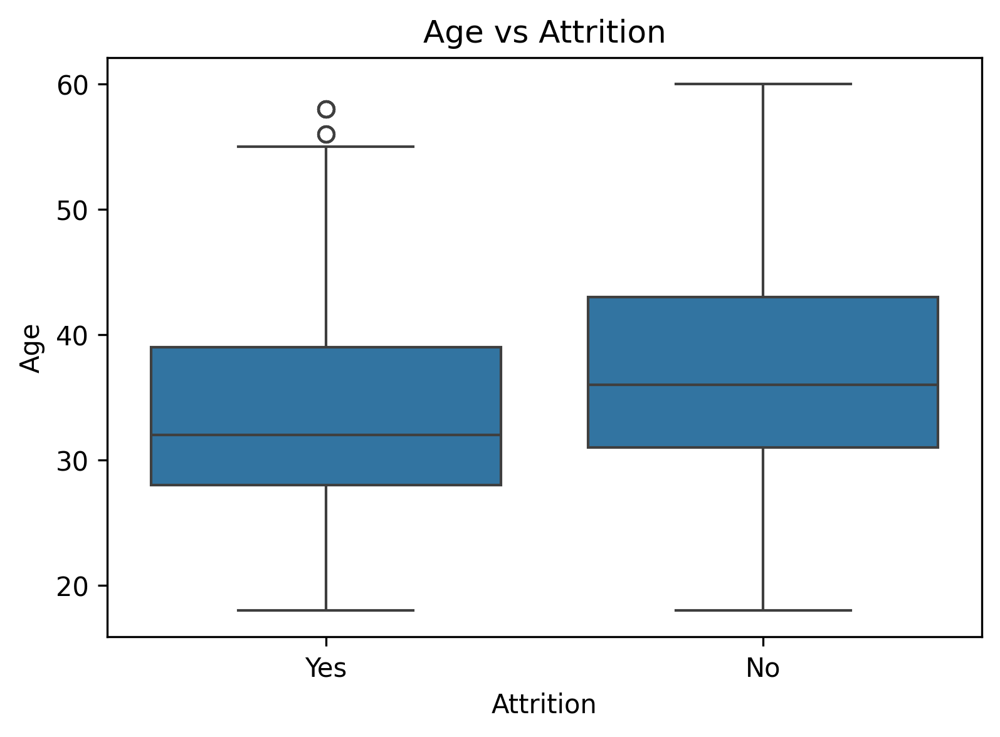
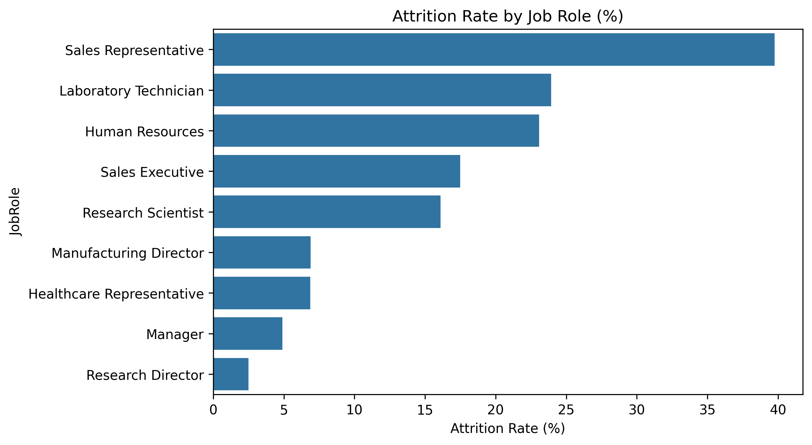
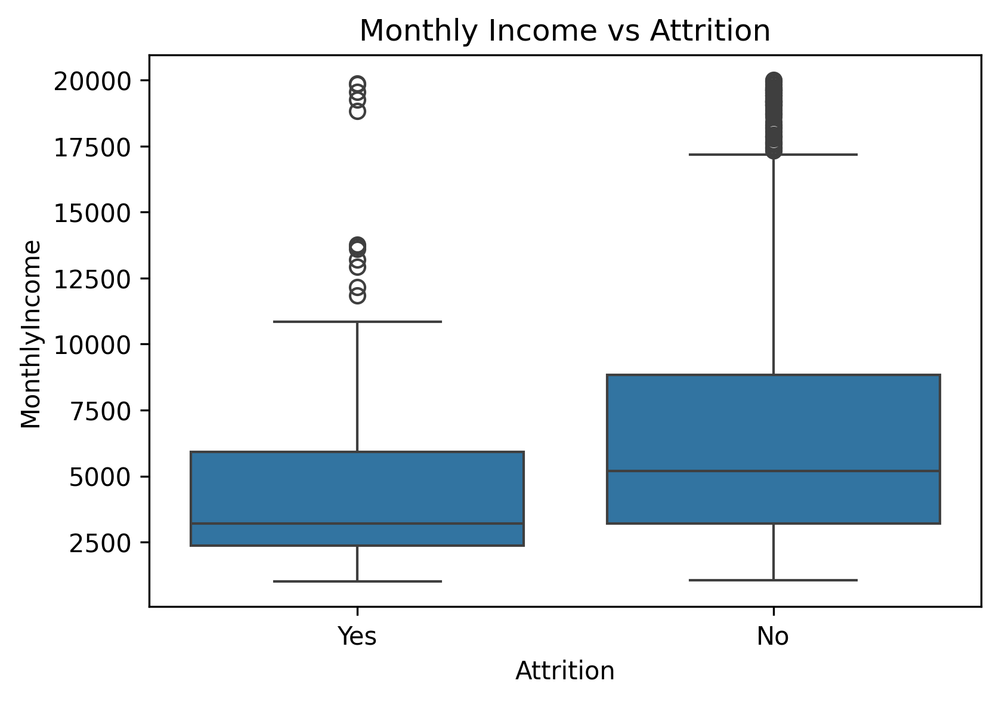
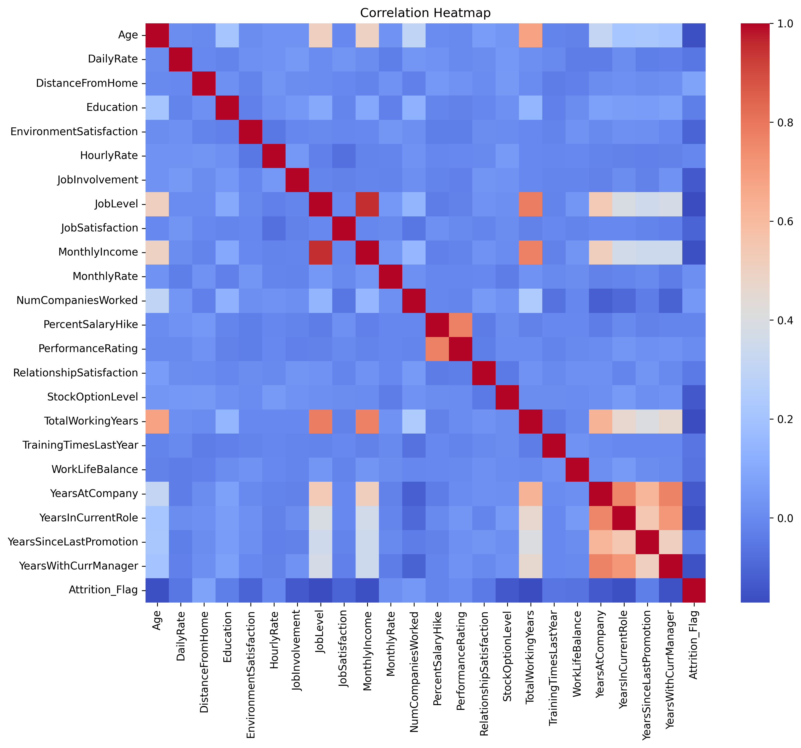
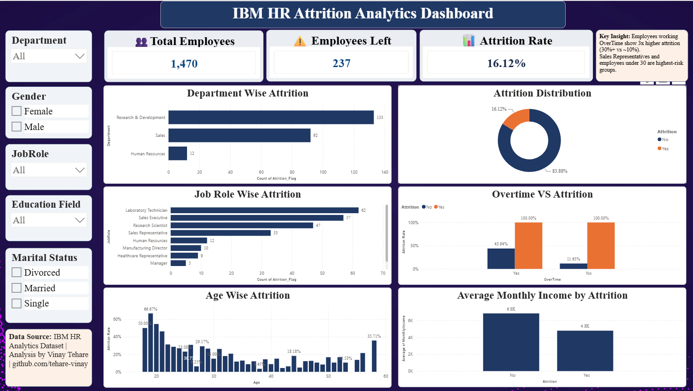

# HR Attrition Analysis

## Overview
Analysis of IBM HR Analytics dataset (1,470 employee records, 35 columns) 
to identify key factors driving employee attrition, using Python, SQL, 
and Power BI.

## Key Findings
- Sales Representatives have the highest attrition rate (~40%)
- Employees working OverTime show nearly 3x higher attrition
- Employees under 30 are the most at-risk age group

## Tools & Technologies
- **Python** (Pandas, Matplotlib, Seaborn) — data cleaning & EDA
- **SQL (SQLite)** — querying attrition patterns by department/role
- **Power BI** — interactive dashboard with DAX measures

## Files
- `hr_attrition_analysis.ipynb` — full analysis notebook
- `HR_Attrition_Cleaned.csv` — cleaned dataset
- `HR_Attrition.db` — SQLite database for SQL queries

## Visualizations

### Attrition by Department

### Attrition by OverTime

### Age vs Attrition

### Attrition by Job Role

### Monthly Income vs Attrition

### Correlation Heatmap

## 📊 Power BI Dashboard

An interactive HR Attrition dashboard built to visualize key attrition drivers and support HR decision-making.

### Key Features
- **KPI Cards:** Total Employees, Employees Left, Attrition Rate
- **Department & Job Role Analysis:** Identifies highest-risk departments and roles
- **OverTime vs Attrition:** Reveals 3x higher attrition among employees working overtime (30%+ vs ~10%)
- **Age-wise Attrition Trends:** Highlights younger employees as higher flight risk
- **Interactive Filters:** Department, Gender, Job Role, Education Field, Marital Status

### Key Insights
- Employees working OverTime show significantly higher attrition (30%+ vs ~10% for non-overtime)
- Sales Representatives have the highest attrition rate (~40%) among all job roles
- Employees under 30 show the highest attrition risk
- No single factor strongly predicts attrition — it's driven by a combination of workload, compensation, and tenure

### Tools Used
Power BI Desktop, DAX measures, SQLite (data source)

📁 [Download Dashboard (.pbix)](HR-Attrition Dashboard.pbix)

## Author
Vinay Tehare | [LinkedIn](https://www.linkedin.com/in/vinay-tehare)
